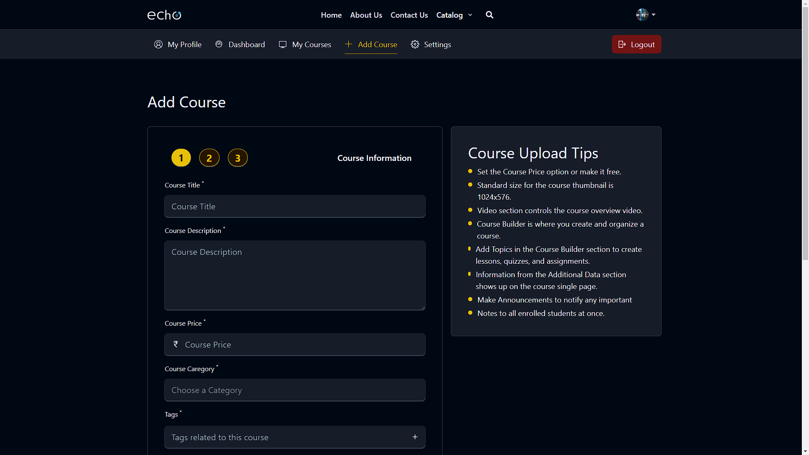
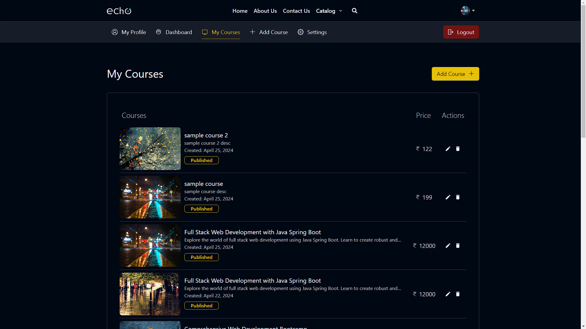

<p id="readme-top" name="readme-top"></p>
<br />
<div align="center">
  <a href="https://echo-an.netlify.app">
    
  </a>

  <h1 align="center">ECHO</h1>

  <p align="center">
    ECHO is an ed tech platform facilitating project-based learning, connecting instructors and students worldwide for diverse learning opportunities.
    <br />
    <br />
    <a href="https://echo-an.netlify.app">View Demo</a>
    ·
    <a href="mailto:navganabhishek90@gmail.com">Report Bug</a>
    ·
    <a href="mailto:navganabhishek90@gmail.com">Request Feature</a>
  </p>
</div>

  <p>Index</p>
  <ol>
    <li>
      <a href="#about-the-project">About The Project</a>
      <ul>
        <li><a href="#built-with">Built With</a></li>
      </ul>
    </li>
    <li><a href="#getting-started">Getting Started</a></li>
    <li><a href="#prerequisites">Prerequisites</a></li>
    <li><a href="#installation">Installation</a></li>
    <li><a href="#usage">Usage</a></li>
    <li><a href="#roadmap">Roadmap</a></li>
    <li><a href="#contributing">Contributing</a></li>
    <li><a href="#contact">Contact</a></li>
    <li><a href="#acknowledgments">Creadits</a></li>
  </ol>

<!-- ABOUT THE PROJECT -->

## About The Project

<a>
    
</a>

<br>
<br>

ECHO is a dynamic ed-tech platform designed to empower instructors to create and sell IT courses across various categories. Admins can manage categories, instructors can develop courses with video lectures, and students can browse and purchase courses using secure online payments. The platform provides tailored dashboards for efficient user management and interaction.

<p align="right">(<a href="#readme-top">back to top</a>)</p>

### Built With

<div align="center">
	<code></code>
	<code></code>
	<code></code>
	<code></code>
	<code></code>
	<code></code>
</div>

<br>

<p align="right">(<a href="#readme-top">back to top</a>)</p>

## Getting Started

To setup the project locally follow these steps:

1. clone the repo

```sh
  git clone https://github.com/AbhishekNavgan95/ECHO
```

2. Navigate to the project directory.

```sh
  cd ECHO
```

3. Install dependencies.

```sh
  npm i
```

## Prerequisites

Set up the environment variables properly.

## Usage

start the development server

```sh
  npm run dev
```

<p align="right">(<a href="#readme-top">back to top</a>)</p>

## Roadmap

```php
    ECHO/
    ├── server/
    │   ├── config/
    │   ├── controllers/
    │   ├── mail/
    │   ├── middlewares/
    │   ├── models/
    │   ├── routes/
    │   ├── utils/
    ├── src/
    │   ├── assets/
    │   ├── components/
    │   │   ├── common/
    │   │   ├── core/
    │   │   ├── Skeletons/
    ├── data/
    ├── hooks/
    ├── pages/
    │   │   ├── common
    │   │   ├── core
    │   │   ├── Skeletons
    ├── reducer/
    ├── services/
    │   │   ├── operations
    ├── slices/
    ├── utils/
    ├── admin/
    │   ├── dashboard.php
    ├──── users.php

```

<p align="right">(<a href="#readme-top">back to top</a>)</p>

## Contributing

Contributions and feedback are welcome! If you have suggestions, found a bug, or want to contribute code, please follow the and submit a pull request. Together, we can make this project even better!

<p align="right">(<a href="#readme-top">back to top</a>)</p>

## Contact

mail <a src="mailto:navganabhishek90@gmail.com">Abhishek Navgan</a>

live demo <a src="https://echo-an.netlify.app/">ECHO</a>

<p align="right">(<a href="#readme-top">back to top</a>)</p>

## CREDITS

Special thanks to Codehelp (Love Babbar) whose DOT Batch Web Development Bootcamp was instrumental in the development of this project. The comprehensive course provided invaluable insights and hands-on experience with complex technologies used in this MERN stack application. Their guidance and expertise played a crucial role in shaping this project and advancing my skills in full-stack web development.

- [Codehelp (Love Babbar) on YouTube](https://youtube.com/@LoveBabbar?si=QNqSbThnoxBSA2Cj)
- [DOT Batch Web Development Bootcamp](https://www.codehelp.in/course/web-development-bootcamp)

I am grateful for the support and knowledge gained from this course, which has empowered me to create innovative solutions and pursue further challenges in the field of web development.

<p align="right">(<a href="#readme-top">back to top</a>)</p>

<!-- MARKDOWN LINKS & IMAGES -->
<!-- https://www.markdownguide.org/basic-syntax/#reference-style-links -->

[contributors-shield]: https://img.shields.io/github/contributors/othneildrew/Best-README-Template.svg?style=for-the-badge
[contributors-url]: https://github.com/othneildrew/Best-README-Template/graphs/contributors
[forks-shield]: https://img.shields.io/github/forks/othneildrew/Best-README-Template.svg?style=for-the-badge
[forks-url]: https://github.com/othneildrew/Best-README-Template/network/members
[stars-shield]: https://img.shields.io/github/stars/othneildrew/Best-README-Template.svg?style=for-the-badge
[stars-url]: https://github.com/othneildrew/Best-README-Template/stargazers
[issues-shield]: https://img.shields.io/github/issues/othneildrew/Best-README-Template.svg?style=for-the-badge
[issues-url]: https://github.com/othneildrew/Best-README-Template/issues
[license-shield]: https://img.shields.io/github/license/othneildrew/Best-README-Template.svg?style=for-the-badge
[license-url]: https://github.com/othneildrew/Best-README-Template/blob/master/LICENSE.txt
[linkedin-shield]: https://img.shields.io/badge/-LinkedIn-black.svg?style=for-the-badge&logo=linkedin&colorB=555
[linkedin-url]: https://linkedin.com/in/othneildrew
[product-screenshot]: images/screenshot.png
[Next.js]: https://img.shields.io/badge/next.js-000000?style=for-the-badge&logo=nextdotjs&logoColor=white
[Next-url]: https://nextjs.org/
[React.js]: https://img.shields.io/badge/React-20232A?style=for-the-badge&logo=react&logoColor=61DAFB
[React-url]: https://reactjs.org/
[Vue.js]: https://img.shields.io/badge/Vue.js-35495E?style=for-the-badge&logo=vuedotjs&logoColor=4FC08D
[Vue-url]: https://vuejs.org/
[Angular.io]: https://img.shields.io/badge/Angular-DD0031?style=for-the-badge&logo=angular&logoColor=white
[Angular-url]: https://angular.io/
[Svelte.dev]: https://img.shields.io/badge/Svelte-4A4A55?style=for-the-badge&logo=svelte&logoColor=FF3E00
[Svelte-url]: https://svelte.dev/
[Laravel.com]: https://img.shields.io/badge/Laravel-FF2D20?style=for-the-badge&logo=laravel&logoColor=white
[Laravel-url]: https://laravel.com
[Bootstrap.com]: https://img.shields.io/badge/Bootstrap-563D7C?style=for-the-badge&logo=bootstrap&logoColor=white
[Bootstrap-url]: https://getbootstrap.com
[JQuery.com]: https://img.shields.io/badge/jQuery-0769AD?style=for-the-badge&logo=jquery&logoColor=white
[JQuery-url]: https://jquery.com

## Project Sneak Peek


<br>

<br>

<br>

<br>

<br>

<br>

<br>

<br>

<br>

<br>

<br>

